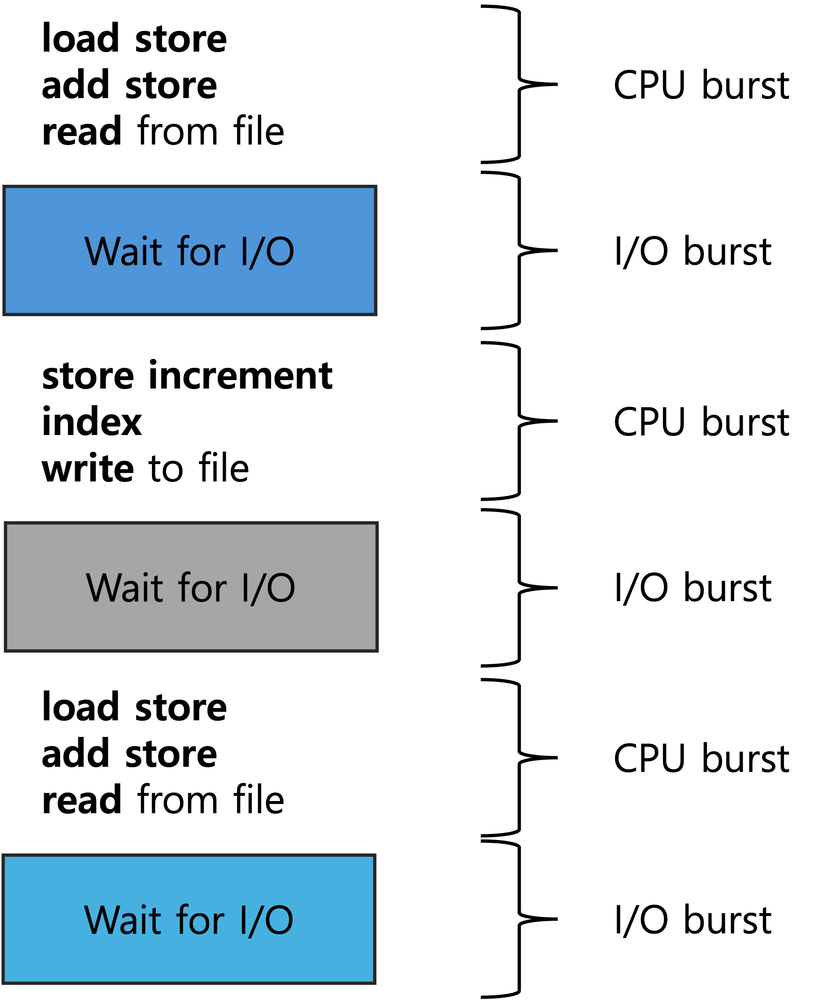

# CPU Scheduling

## 기본 개념
CPU가 하나의 프로세스 작업이 끝나면 다음 프로세스 작업을 수행해야 합니다. 이때 준비 상태에 있는 프로세스들 중 어떤 프로세스에게 CPU를 할당할지 결정하는 방법을 CPU Scheduling이라고 합니다.

### CPU-I/O Burst Cycle

    

프로세스의 실행은 CPU 실행과 I/O 대기의 사이클로 구성됩니다. 프로세스는 이 두 상태를 번갈아 가며 실행합니다. 프로세스 실행은 CPU 버스트로 시작합니다. 

### CPU Scheduler
CPU가 유휴 상태가 될 때마다 운영 체제는 실행할 준비 대기열의 프로세스 중 하나를 선택해야 합니다. 선택 프로세스는 CPU 스케줄러가 수행하며, CPU 스케줄러는 실행 준비가 된 메모리의 프로세스 중에서 프로세스를 선택하고 해당 프로세스에 CPU를 할당합니다.

### 선점 및 비선점 스케줄링(Preemptive and Nonpreemptive Scheduling)
CPU 스케줄링 결정은 네 가지 상황에서 이루어질 수 있습니다.
1. 프로세스가 <b>실행 상태</b>에서 <b>대기 상태</b>로 전환될 때(I/O 발생)
2. 프로세스가 <b>실행 상태</b>에서 <b>준비 상태</b>로 전환될 때(인터럽트 발생)
3. 프로세스가 <b>대기 상태</b>에서 <b>준비 상태</b>로 전환될 때(I/O 종료)
4. 프로세스가 <b>종료</b>될 때

<b>비선점 스케줄링(Non preemptive Scheduling)</b>
- CPU가 한 프로세스에 할당되면 프로세스가 종료하던지, 또는 대기 상태로 전환해 CPU를 방출할 때 까지 점유합니다.(1,4)

<b>선점 스케줄링(Preemptive Scheduling)</b>
- 시분할 시스템에서 타임 슬라이스가 소진되었거나, 인터럽트나 시스템 호출 종료시에 더 높은 우선 순위 프로세스가 발생 되었음을 알았을 때, 현 실행 프로세스로부터 강제로 CPU를 회수하는 것을 말합니다.(2,3)

## 스케줄링 기준
스케줄링 기법의 성능을 평가하기 위한 지표
- CPU 이용률(CPU utilization): 전체 시간 중 CPU가 일을 한 시간의 비율
- 처리량(throughput): 단위 시간당 완료된 프로세스의 개수
- 소요 시간(turnaroung time): 준비 큐에서 기다린 시간과 실제로 CPU를 사용한 시간의 합
- 대기 시간(waiting time): 프로세스가 준비 큐에서 CPU를 얻기 위해 기다린 시간의 합
- 응답 시간(response time): 프로세스가 준비 큐에 들어온 후 첫번째 CPU를 획득하기 까지 기다린 시간

## 스케줄링 알고리즘
준비 큐에 있는 프로세스에 어떻게 CPU 코어에 할당할지 결정하는 문제를 다룹니다.
### 선입 선처리 알고리즘(FCFS, First Come First Served Scheduling)
- CPU를 먼저 요청하는 프로세스가 CPU를 먼저 할당받는 방식
- 비선점형
- 평균 대기 시간, 응답 시간이 길어질 수 있다.
- <b>호위 효과</b>가 발생할 수 있다.
    - CPU 사용시간이 긴 프로세스에 의해 사용시간이 짧은 프로세스들이 오래 기다리는 현상
    - CPU와 장치 이용률이 낮아진다.

### 최단 작업 우선 스케줄링(SJF, Shortest Job First Scheduling)
- CPU 버스트 길이가 짧은 순서대로 순서적으로 CPU에 할당하는 방식
- 비선점형 + 선점형
- 평균 대기 시간을 줄일 수 있다.
- 다음 프로세스의 CPU 버스트 시간을 예측하는 것이 어렵다.
### 라운드 로빈 스케줄링(RR, Round Robin Scheduling)
- 각 프로세스가 CPU를 사용할 수 있는 시간을 특정 시간으로 제한하여 이 시간이 경과하면 프로세스로부터 CPU를 회수해 준비 큐에 있는 다른 프로세스에게 CPU 할당
- 선점형
- 여러 종류의 이질적인 프로세스가 같이 실행되는 환경에 효과적
- 성능이 제한 시간의 길이에 영향 받는다
- 응답 시간을 빠르게 할 수 있다.
### 우선 순위 스케줄링(Priority Scheduling)
- 준비 큐에서 기다리는 프로세스들 중에서 우선순위가 가장 높은 프로세스에게 제일 먼저 CPU를 할당하는 방식
- 비선점형 + 선점형
- 무기한 봉쇄
> ### 무기한 봉쇄(Indefinite Blocking)
> 실행준비는 되어 있으나 CPU를 사용하지 못하는 프로세스는 CPU를 기다리면서 봉쇄 된 것으로 간주하는 것
- 기아 상태
> ### 기아 상태(Starvation)
> 부하가 과중한 컴퓨터 시스템에서는 높은 우선순위의 프로세스들이 꾸준히 들어와서 낮은 우선순위의 프로세스들이 CPU를 얻지 못하게 될 수도 있다.    
> 해결 방법   
> 1. 오랫동안 시스템에서 대기하는 프로세스들의 우선순위를 점진적으로 증가시킨다.(Aging)
> 2. 다단계 큐 스케줄링
### 다단계 큐 스케줄링(Multilevel Queue Scheduling)
- 프로세스를 여러개의 개별 큐로 분할한다.
- 우선순위 스케줄링이 라운드 로빈 스케줄링과 결합한 스케줄링 알고리즘
- 선점형
- 각 큐에는 자체 스케줄링 알고리즘을 구현할 수 있다.
### 다단계 피드백 큐 스케줄링(Multilevel Feedback Queue Scheduling)
- 프로세스가 큐들 사이로 이동하는 것을 허용한다.
- 노화(Aging)와 기아 상태(Starvation)을 예방한다.
- 모든 매개변수 값들을 선정하는 특정 방법이 필요하여 가장 복잡한 알고리즘이다.

### 🎤 면접 질문
- 스케줄링이 무엇인지 설명해주세요.
- CPU Scheduling은 언제 발생하나요?
- CPU Scheduling의 목적은 뭔가요?
- 선점 스케줄링과 비선점 스케줄링의 차이점은 뭔가요?
- 스케줄링 알고리즘의 평가 기준을 말해주세요.

### 📌 참고자료
- [글] https://imbf.github.io/computer-science(cs)/2020/10/18/CPU-Scheduling.html
- [책] Operating System Concepts