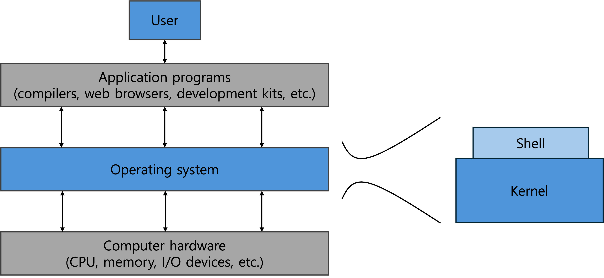

# 운영체제(Operating System)

## 왜 운영체제를 알아야 하나요?
거의 모든 코드가 운영체제 위에서 실행되기 때문에 안전한 프로그래밍을 위해서는 운영체제가 어떻게 작동하는지에 대한 지식을 갖춰야 합니다.

## 운영체제란?
컴퓨터의 <b>성능을 높이고</b> 사용자에게 <b>편의성 제공</b>을 목적으로 하는 컴퓨터 하드웨어 관리하는 소프트웨어입니다.

## 구조

    

## 기능
1. 프로세서, 기억장치, 입출력장치, 파일 및 정보 등의 자원을 관리합니다.
2. 자원을 효율적으로 관리하기 위해 스케줄링 기능을 제공합니다.
3. 사용자와 시스템 간 편리한 인터페이스를 제공합니다.
4. 데이터를 관리하고, 데이터 및 자원의 공유 기능을 제공합니다.

## 주요 자원관리
자원 | 기능
| ---- | ---- |
| 프로세스 관리 | - 프로세스 스케줄링 및 동기화 담당   - 프로세스 생성과 제거, 시작과 정지, 메시지 전달 등의 기능 담당 |
| 기억장치 관리 | 프로세스에게 메모리 할당 및 회수 관리 담당 |
| 주변장치 관리 | 입 출력 장치 스케줄링 및 전반적인 관리 담당 |
| 파일 관리 | 파일의 생성과 삭제, 변경, 유지 등의 관리 담당 |

### 🎤 면접 질문
- OS(운영체제)가 무엇인지 설명해주세요.

### 📌 참고자료
- [글] https://coding-factory.tistory.com/300
- [책] Operating System Concepts